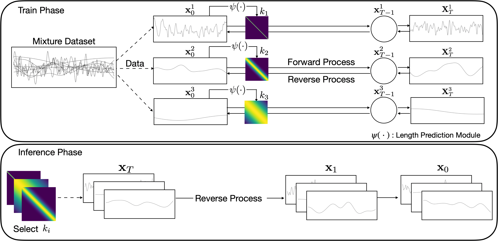
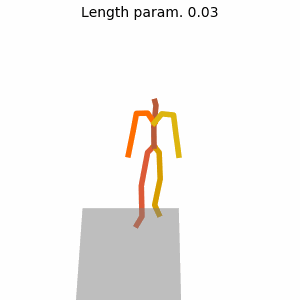
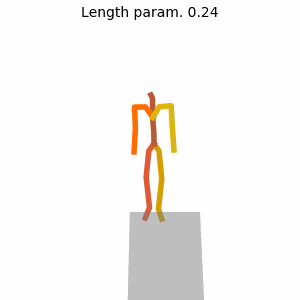
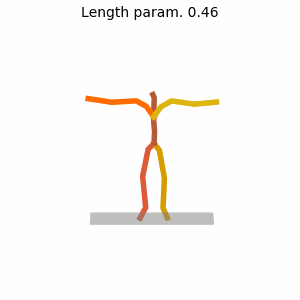
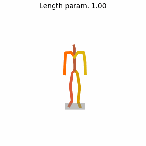

# Adaptive Hilbert Diffusion Models for Controllable Smoothness in Continuous Function Generation

This repo is the official Pytorch implementation of Adaptive-HDM(Adaptive Hilbert Diffusion Models for Controllable Smoothness in Continuous Function Generation). This code is based on the [MDM](https://github.com/GuyTevet/motion-diffusion-model/tree/main).



## Generated Samples
<p align="center">
  
  
  
  
</p>

## Environment <!--Installation-->

This code was tested on `Ubuntu 20.04.6 LTS` and requires:

* Python 3.7
* conda3 or miniconda3
* CUDA capable GPU (one is enough)

Setup conda env:
```shell
conda env create -f environment.yml
conda activate ahdm
python -m spacy download en_core_web_sm
pip install git+https://github.com/openai/CLIP.git
```

## Dataset

### Text-to-Motion
Fllow the instructions in [HumanML3D](), then locate at `./dataset/HumanML3D`.
```shell
cp -r ../HumanML3D/HumanML3D ./dataset/HumanML3D
```

Download dependencies for Text-to-Motion:

```bash
bash prepare/download_smpl_files.sh
bash prepare/download_glove.sh
bash prepare/download_t2m_evaluators.sh
```

## Pre-Trained model

- [Length Prediction Module](https://drive.google.com/file/d/19kDnLs3FKX24_fZXWhdlcQq27-k8zUD_/view?usp=sharing)
- [Text-to-motion](https://drive.google.com/file/d/1L9lMFo3L0KZPVbRUTMpAsb95ELsfKtPE/view?usp=sharing)

Unzip and place them in `./save/`.

## Training
### Text-to-Motion
For Text to motion, we don't compute kernels during training, but use precomputed kernel values. To calculate these kernels, use the command below.

```shell
python3 -m train.pre_calK
```

Subsequently, you can train with below command.
```shell
python3 -m train.train_GPmotion --save_dir 'save/train' --corr_noise --dataset humanml --eval_during_training --diffusion_steps 50 --corr_mode R_trs --param_lenK_path HumanML3D_K_param_data196_fps20_dim263_len10.pkl
```

## Generation
### Text-to-Motion
```shell
python3 -u sample.generate_GP --model_path path/your/model --num_samples 3 --num_repetitions 2 --dataset humanml --param_lenK_path HumanML3D_K_param_data196_fps20_dim263_len10.pkl --text_prompt "A man moves forward." --guidance_param 2.5 --corr_noise --corr_mode R_trs 
```

## Evaluation
### Text-to-Motion
```shell
python3 -m eval.eval_humanml -model_path path/your/model
```
